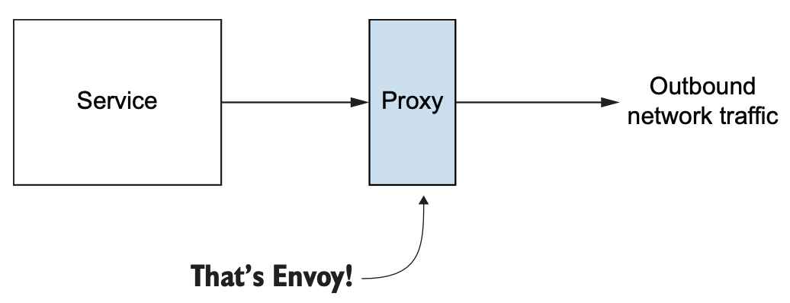
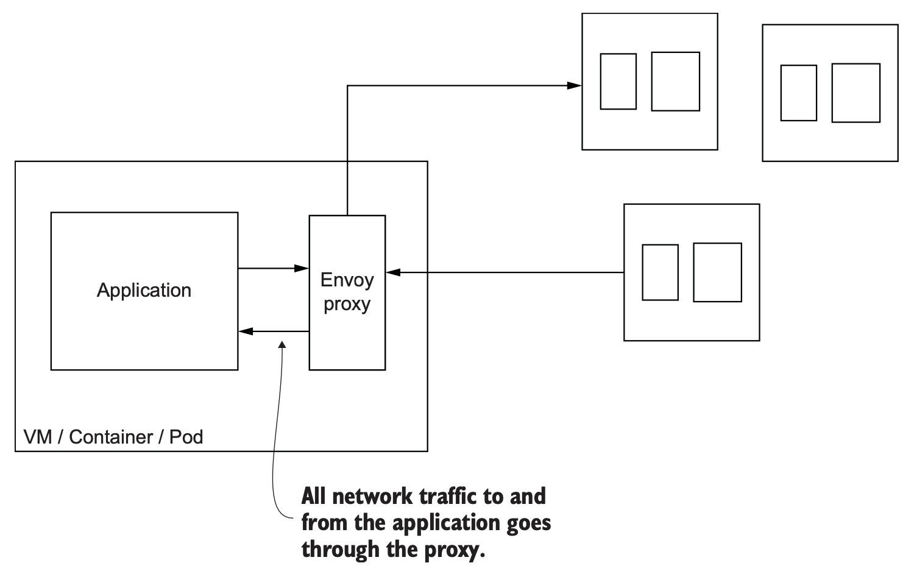
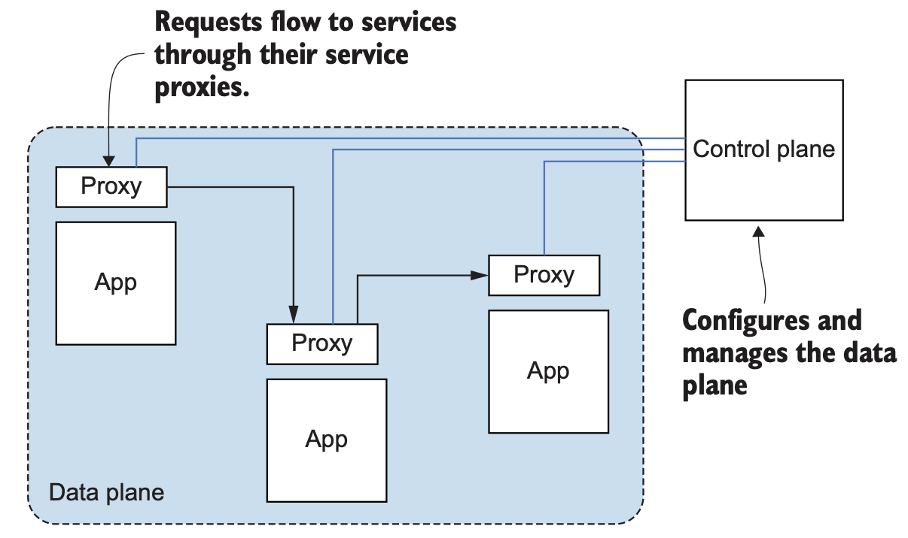

# Introducing

Service-to-service connectivity challenges:

1. service discovery
2. load-balancing
3. timeouts
4. retries
5. circuit-breaking
6. security
7. metric collection

Istio is an open source **service mesh** that helps solve service-to-service connectivity challenges in your cloud and microservices environment **regardless of** what language or framework you use.

Istio is built on an open source proxy named **Envoy**.

The network is not reliable and when we start to build larger, more distributed systems, the network must become a central design consideration in our applications. 

*Service mesh* describes an architecture made up of a **data plane** that uses application-layer proxies to manage networking traffic on behalf of an application and a **control plane** to manage proxies. This architecture lets us build application-networking capabilities outside of the application without relying on a particular programming language or framework.

Istio is an open source implementation of a **service mesh**. It was created initially by folks at Lyft, Google, and IBM.

Istio’s **data plane** is made up of service proxies, based on the Envoy proxy, that live alongside the applications. Those act as intermediaries between the applications and affect networking behavior according to the configuration sent by the **control plane**.

Istio is intended for microservices or service-oriented architecture (SOA)-style architectures.

## 利用application library实现微服务的缺点

1. 各个lib之间紧密耦合，To use Netflix Ribbon for load balancing, you’d need some kind of registry to discover service endpoints, which might mean using Eureka. 这就无形对system增加了很多限制。
2. 如果想引入一种新的语言或框架实现一个新的系统，可能没有对其支持的lib。即使有这样的lib，也很难确保各个语言之间lib的一致性和正确性。 
   Maintaining a handful of libraries across a bunch of programming languages and frameworks requires a lot of discipline and is very hard to get right.

## Envoy Proxy

A proxy is an intermediate infrastructure component that can handle connections and redirect them to appropriate backends. 

The Envoy proxy is an **out-of-process** participant in application networking.

Envoy was developed at Lyft as part of the company’s SOA infrastructure and is capable of implementing networking concerns like **retries, timeouts, circuit breaking, client-side load balancing, service discovery, security, and metrics collection** without any explicit language or framework dependencies.

Envoy also captures many application-networking metrics like **requests per second**, **number of failures**, **circuit-breaking events**, and more. By using Envoy, we can automatically get visibility into what’s happening between our services.

Service proxies can also do things like collect distributed tracing spans so we can stitch together all the steps taken by a particular request. We can see how long each step took and look for potential bottlenecks or bugs in our system.

Envoy既实现了service discovery、client-side load blancing、circuit breanking等微服务通信的功能需求，而且还能自动采集微服务之间网络通信的各项metric。

1. resilience 
2. observability

The Envoy proxy out-of-process from the application, in Kubernetes, we can co-deploy a service proxy with our application in a single Pod.

## What’s a service mesh?

A *service mesh* is a distributed application infrastructure that is responsible for handling network traffic on behalf of the application in a transparent, out-of-process manner. 

Figure 1.8 shows how service proxies form the *data plane* through which all traffic is handled and observed.

The data plane is responsible for establishing, securing, and controlling the traffic through the mesh.

The data plane behavior is configured by the *control plane*. The control plane is the brains of the mesh and exposes an API for operators to manipulate network behaviors.

Together, the data plane and the control plane provide important capabilities necessary in any cloud-native architecture:

1. Service resilience
2. Observability signals
3. Traffic control capabilities
4. Security
5. Policy enforcement

The service mesh takes on the responsibility of making service communication resilient to failures by implementing capabilities like retries, timeouts, and circuit breakers. 

Since all the traffic flows through the mesh, operators can control and direct traffic explicitly. And we’re also able to capture detailed signals about the behavior of the network by tracking metrics like request spikes, latency, throughput, failures, and so on. 

The service mesh provides all of these capabilities to service operators **with very few or no application code changes**.

With a service mesh, it doesn’t matter what application framework or programming language you’ve used to build your application.

