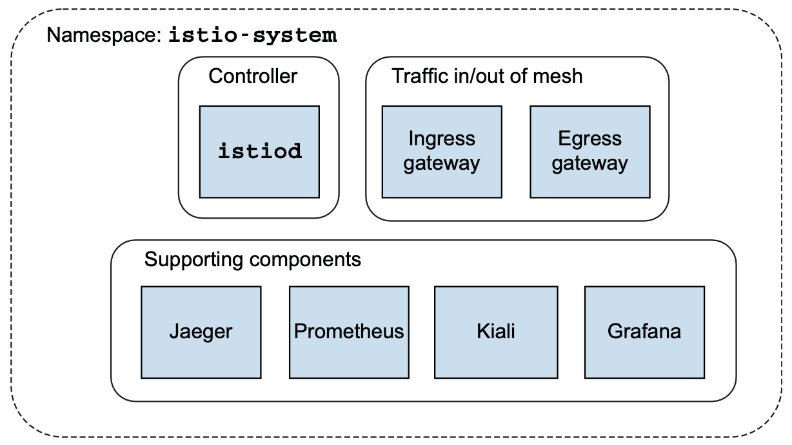

## Istio control plane

The control plane provides a way for users of the service mesh to control, observe, manage, and configure the mesh.

Istio control plane and supporting components:



### Istiod

Istio’s control-plane responsibilities are implemented in the istiod component.

Istiod is responsible for taking **higher-level Istio configurations** specified by the user and turning them into **proxy-specific configurations** for each data-plane service proxy:


xDS API enables the control plane to dynamically configure the service proxies.

Istiod takes these configurations, interprets them, and exposes them as service-proxy-specific configurations.

Istio uses Envoy as its service proxy, so these configurations are translated to Envoy configurations.

Istiod通过Kubernetes API接收的是“higher-level Istio configurations”，它会将接收到的configuration翻译成Envoy proxy的配置，并通过xDS API分发给所有的proxy。

### Istio配置的一个例子

For a service trying to talk to a catalog service, we may wish to send traffic to v2 of the service if it has the header x-dark-launch in its request. We can express that for Istio with the following configuration:

```yaml
apiVersion: networking.istio.io/v1alpha3
kind: VirtualService
metadata:
  name: catalog
spec:
  hosts:
  - catalog
  http:
  - match:
    - headers:
        x-dark-launch:   # match条件
          exact: "v2"
    route:
    - destination:       # 满足match条件的路由
        host: catalog
        subset: version-v2
  - route:  
    - destination:   # 默认路由
        host: catalog
        subset: version-v1
```

The configuration specifies that we would like to route a request to the v2 deployment of the catalog service when there is a header `x-dark-launch` that equals v2; and that for all other requests, we will route to v1 of the catalog service.

可以利用kubectl命令创建这个configuration：

```shell
kubectl apply -f catalog-service.yaml
```

### 翻译成Envoy配置

Istio reads Istio-specific configuration objects, like VirtualService in the previous configuration, and translates them into Envoy’s native configuration.

上面的Istio配置将会被翻译成如下的Envoy配置：

```json
"domains": [
  "catalog.prod.svc.cluster.local"
],
"name": "catalog.prod.svc.cluster.local:80",
"routes": [
  {             // 对应满足match条件的路由配置
    "match": {
      "headers": [
        {
          "name": "x-dark-launch",
          "value": "v2"
        } 
      ],
      "prefix": "/"
    },
    "route": {
        "cluster":"outbound|80|v2|catalog.prod.svc.cluster.local",
        "use_websocket": false
    }
  }, 
  {              // 对应默认路由配置
    "match": {
      "prefix": "/"
    },
    "route": {
      "cluster": "outbound|80|v1|catalog.prod.svc.cluster.local",
      "use_websocket": false
    }
  }
]
```

xDS APIs allow the data plane to separate how it is configured and dynamically adapt its behavior **without having to stop and reload.**

### Ingress and egress gateway

Incoming and outgoing traffic flow through Istio gateways:


ingressgateway and egressgateway components are really Envoy proxies that can understand Istio configurations.


