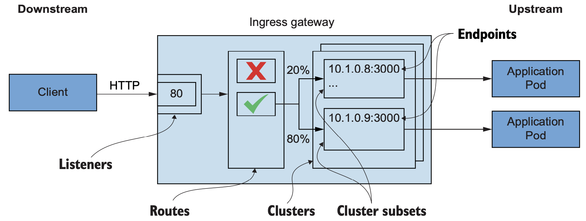
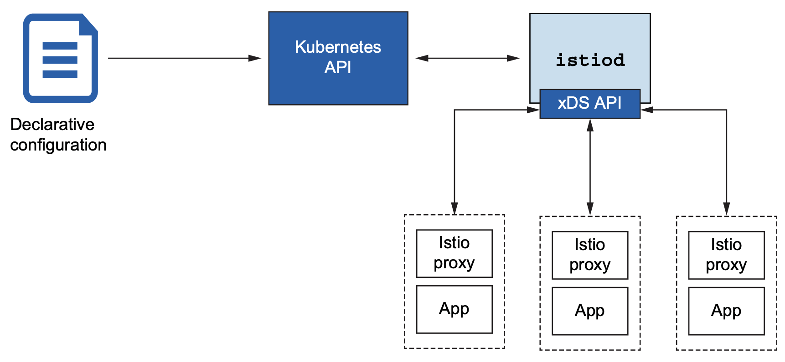
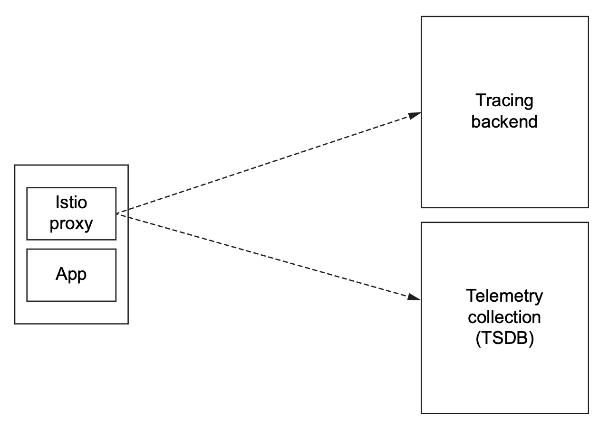
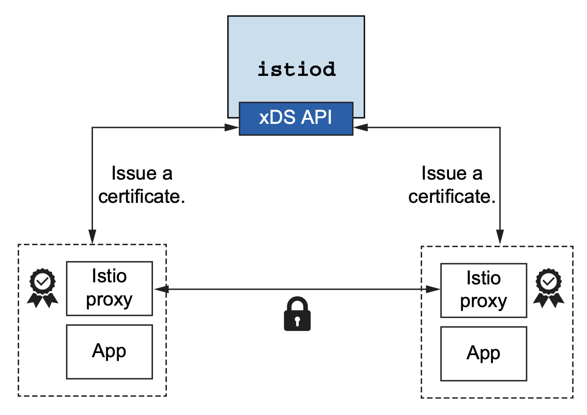

# The Envoy proxy

A service proxy runs collocated and out of process with the application, and the application talks through the service proxy whenever it wants to communicate with other services.

With Istio, the Envoy proxies are deployed collocated with **all application instances** participating in the service mesh, thus forming the service-mesh **data plane**.

Envoy was developed at Lyft, it was contributed as an open source project in September 2016, and a year later (September 2017) it joined the Cloud Native Computing Foundation (CNCF). Envoy is written in **C++** in an effort to increase performance and, more importantly, to make it more stable.

Proxies can simplify what a client needs to know when talking to a service. For example, a service may be implemented as a set of instances (a cluster), each of which can handle a certain amount of load. **How should the client know which instance or IP address to use when making requests to that service?** A proxy can stand in the middle with a single identifier or IP address, and clients can use that to talk to the instances of the service.

A proxy can hide backend topology from clients and implement algorithms to fairly distribute traffic (load balancing):


Envoy can understand layer 7 protocols that an application may speak when communicating with other services. For example, out of the box, Envoy understands HTTP 1.1, HTTP 2, gRPC.

Envoy除了支持HTTP协议外，还可以支持其他的通信协议。

Envoy can be extended to understand protocols in addition to the out-of-the-box defaults. Filters have been written for databases like MongoDB, DynamoDB, and even asynchronous protocols like Advanced Message Queuing Protocol (AMQP).

## Envoy concepts at a high level

#### 1. Listeners

Expose a port to the outside world to which applications can connect. 

For example, a listener on port 80 accepts traffic and applies any configured behavior to that traffic.

#### 2. Routes

Routing rules for how to handle traffic that comes in on *listeners*.

For example, if a request comes in and matches /catalog, direct that traffic to the catalog cluster.

#### 3. Clusters

Specific upstream services to which Envoy can route traffic. 

For example, catalog-v1 and catalog-v2 can be separate clusters, and routes can specify rules about how to direct traffic to either v1 or v2 of the catalog service.

A request comes in from a downstream system through the **listener**, goes through the **routing rules**, and ends up going to a **cluster** that sends it to an upstream service.



PS：Request从下游发送到上游，数据从上游流向下游。

## Static configuration

We can specify listeners, route rules, and clusters using Envoy’s configuration file. The following is a very simple Envoy configuration:

```yaml
static_resources:
  listeners: 
  - name: httpbin-demo
    address:
      socket_address: {
        address: 0.0.0.0, 
        port_value: 15001 
      }
    filter_chains:   # filter_chains配置属于Listener配置的一部分
    - filters:
      - name: envoy.http_connection_manager
        config:
          stat_prefix: egress_http 
          route_config:                     # Route rules
            name: httpbin_local_route
            virtual_hosts:
            - name: httpbin_local_service
              domains: ["*"] 
              routes:
              - match: { prefix: "/" }
                route:
                  auto_host_rewrite: true
                  cluster: httpbin_service  # Route to a cluster
          http_filters:
          - name: envoy.router
  clusters:
    - name: httpbin_service  # Upstream cluster
      connect_timeout: 5s
      type: LOGICAL_DNS
      dns_lookup_family: V4_ONLY
      lb_policy: ROUND_ROBIN
      hosts: [{ 
        socket_address: {
          address: httpbin, 
          port_value: 8000 
        }
      }]
```


### Dynamic configuration

Envoy can use a set of APIs to update configuration without any downtime or restarts.

Envoy uses the following APIs for dynamic configuration:

##### Listener discovery service(LDS)

An API that allows Envoy to query what listeners should be exposed on this proxy.

##### Route discovery service(RDS)

Part of the configuration for listeners that specifies which routes to use. This is a subset of LDS for when static and dynamic configuration should be used.

##### Cluster discovery service (CDS)

An API that allows Envoy to discover what clusters and respective configuration for each cluster this proxy should have.

##### Endpoint discovery service (EDS)

Part of the configuration for clusters that specifies which endpoints to use for a specific cluster. This is a subset of CDS.

##### Secret discovery service (SDS)

An API used to distribute certificates.

##### Aggregate discovery service (ADS)

A serialized stream of all the changes to the rest of the APIs. You can use this single API to get all of the changes in order.

These APIs are referred to as the *xDS* services. A configuration can use one or some combination of them; you don’t have to use them all. 

## How Envoy fits with Istio

We saw that due to Envoy’s capabilities, we can configure a group of service proxies using static configuration files or a set of *xDS discovery services* for discovering listeners, endpoints, and clusters at run time. **Istio implements these xDS APIs in the istiod control-plane component**.

A related example is Envoy’s service discovery, which relies on a service registry of some sort to discover endpoints.

Istiod implements this API but also abstracts Envoy away from any particular service-registry implementation. When Istio is deployed on Kubernetes, **Istio uses Kubernetes’ service registry for service discovery**. The Envoy proxy is completely shielded from those implementation details.

服务发现的实现是由istiod完成的，在不同的环境中istiod会采用不同的实现方式。当istio被部署在kubernetes中时，istiod会利用K8S的Service实现服务发现。实现细节对Envoy Proxy是屏蔽的，Proxy并不需要了解服务发现的实现细节，它只需要知道提供服务的endpoint都有哪些就可以了。

Istio abstracts away the service registry and provides an implementation of Envoy’s xDS API.



Istio helps configure and integrate with metrics collection and distributed-tracing infrastructure：

Tracing backend 可以用 Jaeger

TSDB 就是Prometheus



istiod delivers application-specific certificates that can be used to establish mutual TLS to secure traffic between services.



#### 以上就是Istiod与Envoy Proxy如何一起配合工作的几个例子！！！