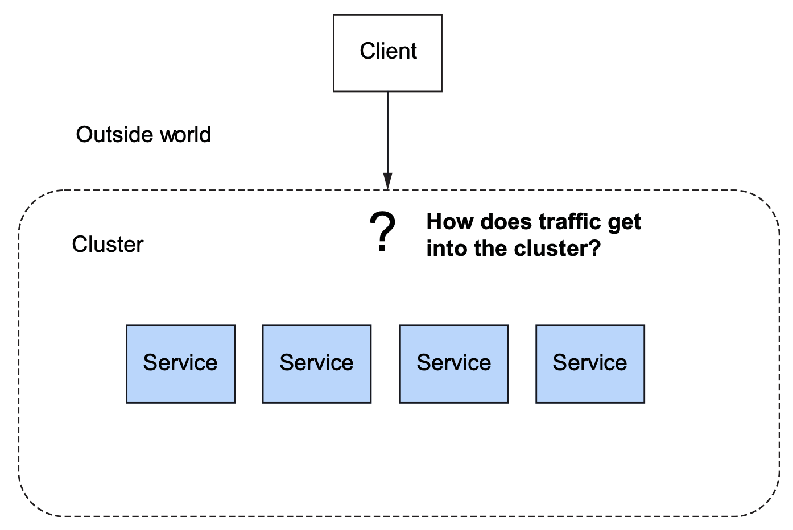
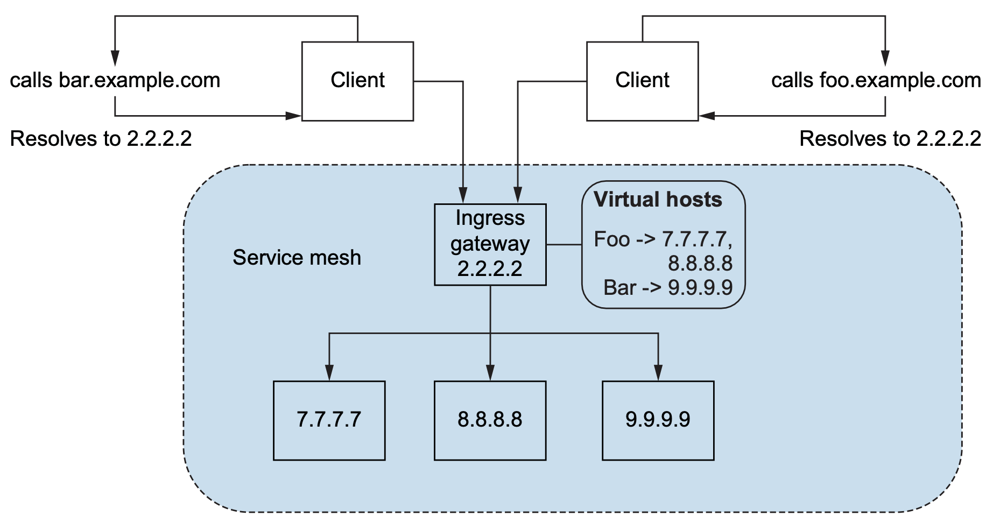
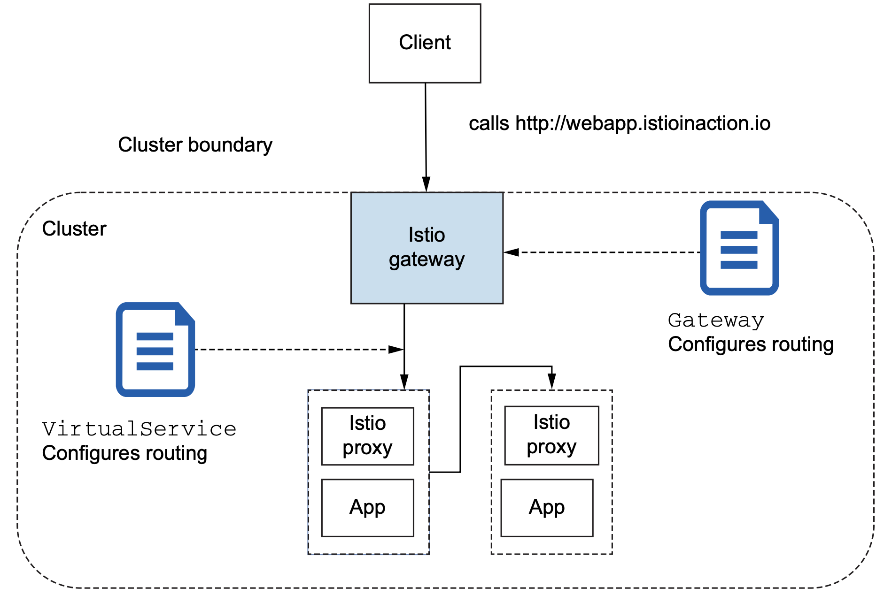

How do we get traffic from the outside of the cluster?

## Ingress Gateway

*Ingress* refers to traffic that originates outside the network. 

The traffic is first routed to an ingress point that acts as a **gatekeeper** for traffic coming into the network. 

Istio has the concept of an *ingress gateway* that is responsible for guarding and controlling access to the cluster from traffic that originates outside of the cluster. Additionally, Istio’s ingress gateway handles **load balancing** and **virtual-host routing**.

Istio uses a **single** Envoy proxy as the ingress gateway.

An Istio ingress gateway plays the role of a network ingress point and uses an Envoy proxy to do routing and load balancing:



## Gateway Resource

To configure Istio’s ingress gateway to allow traffic into the cluster, we’ll start by exploring Istio **Gateway** resources.

we use the Gateway resource and specify which ports we wish to open and what virtual hosts to allow for those ports.

Below example exposes an HTTP port on port 80 that accepts traffic destined for virtual host `webapp.istioinaction.io`:

```yaml
apiVersion: networking.istio.io/v1alpha3
kind: Gateway
metadata:
  name: coolstore-gateway    			 # Name of the gateway
spec:
  selector:
    istio: ingressgateway					# Which gateway implementation			
  servers:
  - port:
      number: 80    							 # Ports to expose
      name: http
      protocol: HTTP
    hosts:
    - "webapp.istioinaction.io"    # Host(s) for this port
```

To create the configuration, run the following:

```shell
kubectl -n istioinaction apply -f coolstore-gw.yaml
```

So far, all we’ve done is configure an Istio gateway to expose a specific port, expect a specific protocol on that port, and define specific hosts to serve from the port/protocol pair. 

When traffic comes into the gateway, we need a way to get it to a specific service within the service mesh; and to do that, we’ll use the VirtualService resource.

In Istio, a VirtualService resource defines how a client talks to a specific service through its fully qualified domain name.

```yaml
apiVersion: networking.istio.io/v1alpha3
kind: VirtualService
metadata:
  name: webapp-vs-from-gw				# Name of the virtual service
spec:
  hosts:
  - "webapp.istioinaction.io"		# Virtual host name(s) to match
  gateways:
  - coolstore-gateway						# Gateways to which this applies
  http:
  - route:
    - destination:							# Destination service for this traffic
        host: webapp
        port:
        	number: 8080
```

With this VirtualService resource, we define what to do with traffic when it comes into the gateway.

In this case, as you can see from the `spec.gateways` field, these traffic rules apply only to traffic coming from the `coolstore-gateway` gateway definition, which we created in the previous section.

VirtualService定义的就是一系列traffic rules。

Additionally, we specify the virtual host `webapp.istioinaction.io` for which traffic must be destined for these rules to match.

To create the configuration, run the following:

```shell
kubectl apply -n istioinaction -f coolstore-vs.yaml
```

The **Gateway** resource defines ports, protocols, and virtual hosts that we wish to listen for at the edge of our service-mesh cluster.

**VirtualService** resources define where traffic should go once it’s allowed in at the edge.

